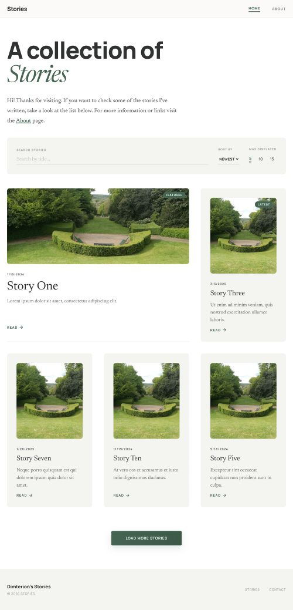
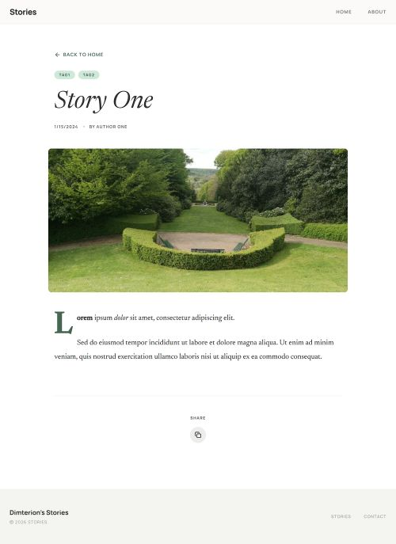

# Stories

A web-site to store a collection of stories.

  

## 📋 Table of Contents

- [Features](#features)
- [Tech Stack](#tech-stack)
- [Screenshots](#screenshots)
- [Live Version](#live-version)
- [Contact Info](#contact-info)

## 📌 Features

- A library of stories to read
- View story cards with general description to choose from
- Search for stories, sort newest/oldest or A-Z/Z-A
- Read stories on their dedicated pages

## ⚙️ Tech Stack

- React
- React Router
- React Markdown
- JavaScript
- CSS

## 📷 Screenshots

### Home Page

**Caption:** Home page with individual posts cards.

### Post Page

**Caption:** Post page for individual posts.

## 🔗 Live version

[Stories](https://stories.dimterion.com/)

## 📫 Contact info

### Profile links ⬇️

**Note:** Ctrl+Click (Windows/Linux) or Cmd+Click (macOS) the image to open link in a new tab.
